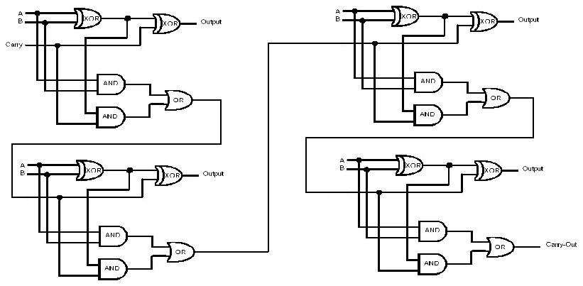
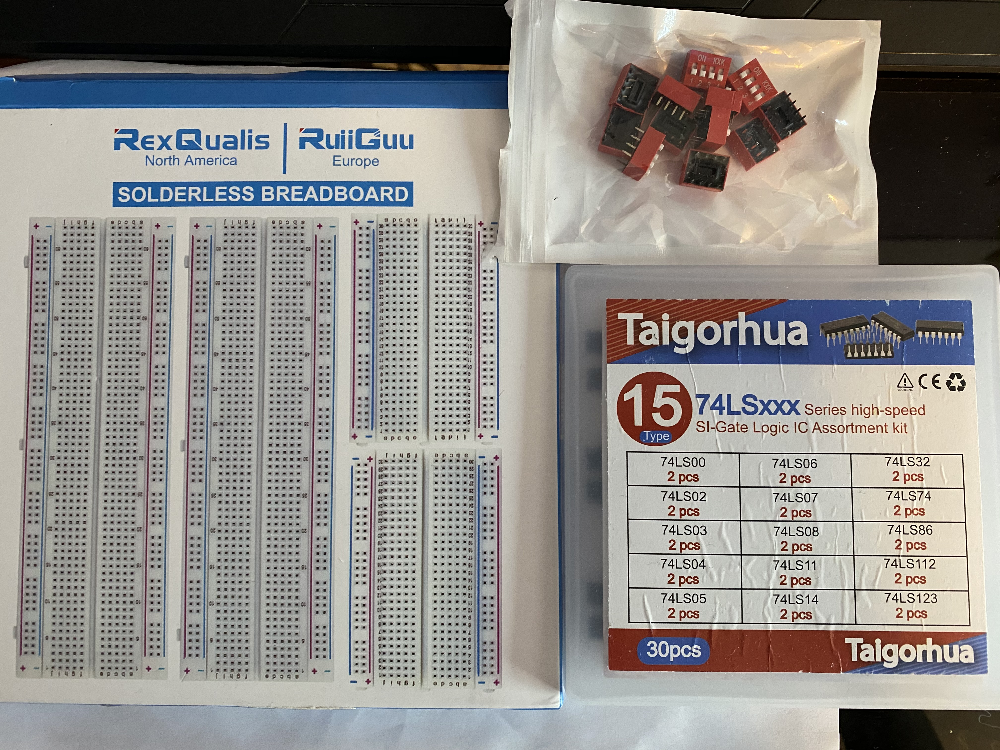
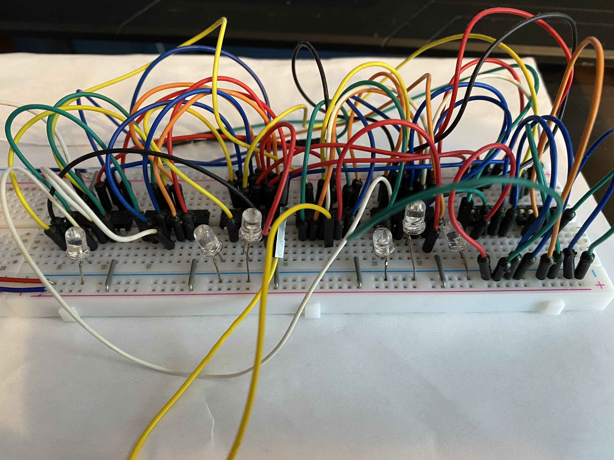
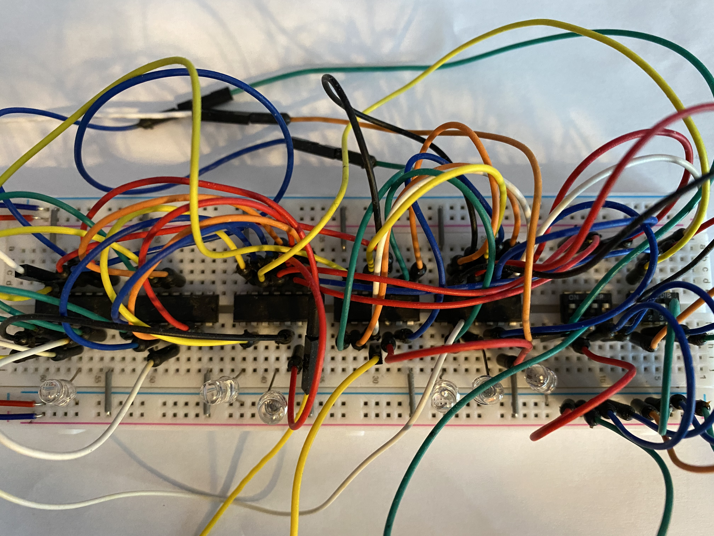
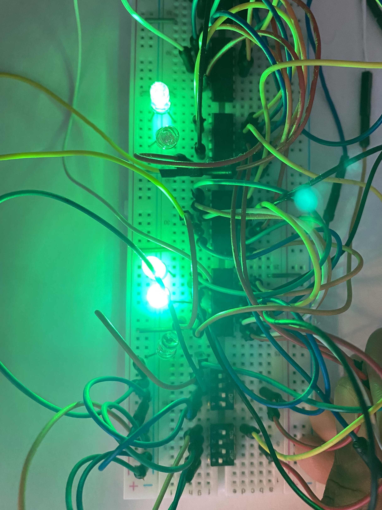

# 4-Bit-Logic-Calculator
4 bit logic calculator using standard logic gates and LED lights to represent each binary digit.
## Getting Started

Here is the blueprint of what a 4 bit calculator looks like using logic gates. The output in this case would be the glowing LED lights.

The parts used to build the calculator include standard breadboard logic gates that include XOR, OR, and AND gates. In addition, standard copper wires, 5 volt power source, and DIP switches are needed.

### Final Product
After following the blueprint to connect all the gates to their respective lights and have a 5 volt power source ready. The final output will look as followed.

Displayed here is the operation 0011 + 1010 = 01101 
